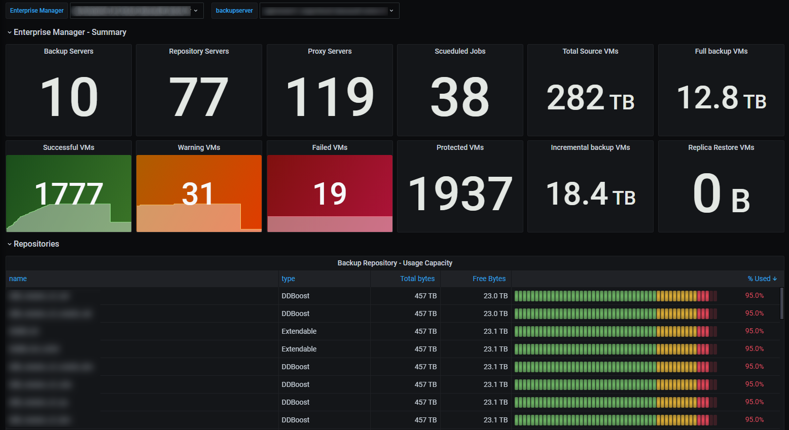

# veeam_exporter

## Overview



## Description

Prometheus exporter for Veeam Entreprise Manager

This exporter collect metrics from Veeam Enterprise Manager HTTP API.

It is a python HTTP server that exposes metrics to http (default port 9247) that can be then scrapped by Prometheus.

Several Veeam server can be polled by adding them to the YAML config file:

**Config**: (see config.yml)

```yaml
veeams:
  - host: host.domain
    port: 9398
    user: 'user'
    password: 'password'
#   protocol: https
#   verify_ssl: false
#   timeout: 20
#   keep_session: true # default
#   default_labels:
#     - name: veeam_em
#       value: my_veeam_em_server.domain
#       proxy:
#         url: http://my.proxy.domain:port/
#         protocol: https

weblisten:
  address: 0.0.0.0
  port: 9247

logger:
  level: info
  facility: syslog

metrics_file: "metrics/*_metrics.yml"
```

## Usage

The exporter runs as a standalone python script.
<summary>Usage as a Python Script</summary>

<br>

To use the exporter, few packages needs to be installed. This can be done using:

```shell
pip3 install -r pip_requirements.txt
```

<details>

Contents of requirements.txt

```python
Prometheus-client>=0.8.0
requests==2.23.0
PyYAML==5.3.1
tenacity==6.2.0
urllib3>=1.25.9
Jinja2>=2.11.2
```

</details>

Consider, to extract the archiv file in /opt folder; this will generate a folder /opt/veeam_exporter_1.0.0.1_linux-amd64.
Then edit the config.yml file and add your settings.

## exporter command line options

to start the exporter:

```shell
./veeam_exporter &
```

By default, it will load the file config.yml to perform action.

<details>
<summary>Detail options</summary>

```shell

Usage: veeam_exporter [-h] [-b BASE_PATH] [-c CONFIG_FILE]
                      [-f LOGGER.FACILITY] [-l {error,warning,info,debug}]
                      [-o  METRICS_FILE] [-m  METRIC] [-n] [-t  TARGET]
                      [-w WEB.LISTEN_ADDRESS] [-V] [-v]

collector for veeam server.

optional arguments:
  -h, --help            show this help message and exit
  -b BASE_PATH, --base_path BASE_PATH
                        set base directory to find default files.
  -c CONFIG_FILE, --config_file CONFIG_FILE
                        path to config files.
  -f LOGGER.FACILITY, --logger.facility LOGGER.FACILITY
                        logger facility (syslog or file path).
  -l {error,warning,info,debug}, --logger.level {error,warning,info,debug}
                        logger level.
  -o  METRICS_FILE, --metrics_file METRICS_FILE
                        collect the metrics from the specified file instead of
                        config.
  -m  METRIC, --metric METRIC
                        collect only the specified metric name from the
                        metrics_file.
  -n , --dry_mode       collect the metrics then exit; display results to
                        stdout.
  -t  TARGET, --target TARGET
                        In dry_mode collect metrics on specified target.i
                        Default first from config file.
  -w WEB.LISTEN_ADDRESS, --web.listen-address WEB.LISTEN_ADDRESS
                        Address to listen on for web interface and telemetry.
  -V, --version         display program version and exit..
  -v , --verbose        verbose mode; display log message to stdout.
```

</details>

To test your configuration you can launch the exporter in dry_mode:

```shell
./veeam_exporter -v -n -t host.domain
```

This command will try to connect to the 'host.domain' veeam server with parameters specified in config.yml, expose the collected metrics, and eventually the warning or errors, then exits.

## Metrics

The collected metrics are defined in separetedi files positionned the folder metrics.
All Values, computations, labels are defined in the metrics files, meaning that the exporter doesn't nothing internally on values. The configuration fully drives how values are rendered.

## Prometheus config

## Extending metrics

Exported metrics, are defined the YAML config file. The value can use Jinja2 templating language. The format of the configuration is inspired from Ansible task representation.
So a metric configuration file, consists in a list of action to perform.

There are five possible actions:

- url: to collect metrics from HTTP API
- set_fact: to assign vlaue to variables
- actions: to perform a list of (sub-)actions
- metrics: to define metrics to expose/return to Prometheus
- debug: to display debug text to logger.

All actions have default "attributes":

- name: the name of action or metric counter for metrics action.
- vars: to set vars to global symbols' table.
- with_items: to loop on current action with a list of items.
- loop_var: to set the name of the variable that will receive the current value in the loop. Default is 'item'.
- when: a list of condition (and) that must be check and be true to perform the action.

The "attributes" are analyzed in the order specified in previous table; it means that you can't use "item" var (obtained from 'with_items' directive) in the vars section because it is not yet defined when the 'vars' section is evaluated. If you need that feature, you will have to consider 'with_items' in an 'actions' section (see metrics/backup_jobs_sessions_metrics.yml).

action | parameter | description | remark
------ | ----------- | ------ | ------
url | &nbsp; |a string that's representing the entity to collect without '/api' | <http://host.domain:port/api**[url>]**. e.g.: /reports/summary/overview
 &nbsp; | var_name |the name ofthe variable to store the results. Default is '_root' meaning that the resulting JSON object is directly store in symbols table. | &nbsp;
 &nbsp; | &nbsp; | &nbsp; | &nbsp;
 set_fact | &nbsp; | list of variable to define | &nbsp;
 &nbsp; | var_name: value| &nbsp;  
 &nbsp; | &nbsp; | &nbsp; | &nbsp;
metrics | &nbsp; | define the list of metrics to expose
 &nbsp; | metric_prefix | a prefix to add to all metric name | final name will be [metric_prefix]_[metric_name]
 'a metric' | name | the name of the metric
 &nbsp; | help | the help message added to the metric (and displayed in grafana explorer)
 &nbsp; | type 'gauge' or 'counter' | the type of the prometheus metric | &nbsp;
 &nbsp; | value | the numeric value itself | &nbsp;
 &nbsp; | labels | a list of name value pairs to qualify the metric | &nbsp;
